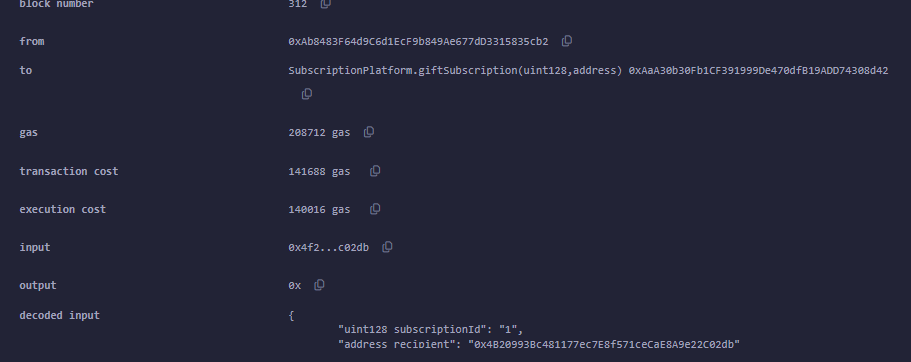

# Sample Hardhat 3 Beta Project (`mocha` and `ethers`)

This project showcases a Hardhat 3 Beta project using `mocha` for tests and the `ethers` library for Ethereum interactions.

To learn more about the Hardhat 3 Beta, please visit the [Getting Started guide](https://hardhat.org/docs/getting-started#getting-started-with-hardhat-3). To share your feedback, join our [Hardhat 3 Beta](https://hardhat.org/hardhat3-beta-telegram-group) Telegram group or [open an issue](https://github.com/NomicFoundation/hardhat/issues/new) in our GitHub issue tracker.

## Project Overview

This example project includes:

- A simple Hardhat configuration file.
- Foundry-compatible Solidity unit tests.
- TypeScript integration tests using `mocha` and ethers.js
- Examples demonstrating how to connect to different types of networks, including locally simulating OP mainnet.

## Usage

### Running Tests

To run all the tests in the project, execute the following command:

```shell
npx hardhat test
```

You can also selectively run the Solidity or `mocha` tests:

```shell
npx hardhat test solidity
npx hardhat test mocha
```

### Make a deployment to Sepolia

This project includes an example Ignition module to deploy the contract. You can deploy this module to a locally simulated chain or to Sepolia.

To run the deployment to a local chain:

```shell
npx hardhat ignition deploy ignition/modules/Counter.ts
```

To run the deployment to Sepolia, you need an account with funds to send the transaction. The provided Hardhat configuration includes a Configuration Variable called `SEPOLIA_PRIVATE_KEY`, which you can use to set the private key of the account you want to use.

You can set the `SEPOLIA_PRIVATE_KEY` variable using the `hardhat-keystore` plugin or by setting it as an environment variable.

To set the `SEPOLIA_PRIVATE_KEY` config variable using `hardhat-keystore`:

```shell
npx hardhat keystore set SEPOLIA_PRIVATE_KEY
```

After setting the variable, you can run the deployment with the Sepolia network:

```shell
npx hardhat ignition deploy --network sepolia ignition/modules/Counter.ts
```

Mitt mål var att uppnå VG nivå. Jag har gjort väldigt många tester och uppnåt en coverage på 100%

några tester kan vara onödiga men jag vågar inte radera testerna när jag uppfyllt 100%. När jag väl lärde mig att titta på undercoverd lines och partially coverd lines såg jag vad som jag hade missat att fylla i. oftast if satser som inte testat.

// När det gäller gasoptimeringar så har jag i mitt kontrakt nu uint som inte är så gasoptimerat, det ligger också strings emellan uint som gör att det går åt mer gas. Nedan visar jag några av mina gasoptimeringar före och efter jag ändrat mina uints

//deploy contract
Before


jag märkte att det kostade mer att göra ändringarna på mina uints och extra mapping
men i mina funktioner så blev gaskostnaderna mindre.

här är min createSubscription


min subscribe function


min struct förändring


ändrat memory till calldata för gasoptimering


jag har tagit bort mina loopar i subscribe och giftSubscription för att göra det mer gasoptimerat OM jag får mer subscribers.. jag räknar med att gå många som gåvar och prenumererar på mina prenumerationer därför gör det inget att jag får högre gas genom att använda mapping



